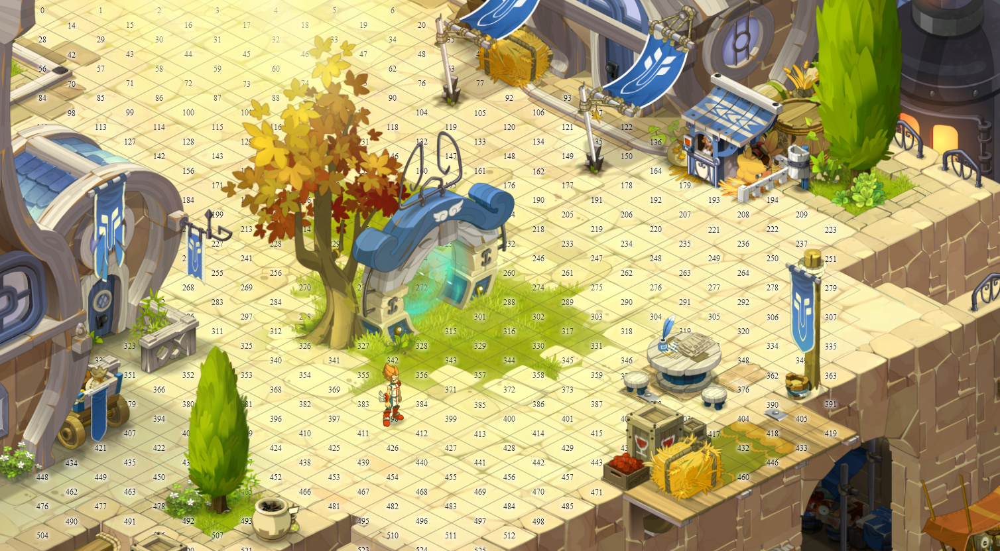

# Les .dlm 

Les fichiers .dlm se trouvent dans les fichiers .d2p 
Une fois apres avoir unpack votre .d2p vous allez vous retrouver avec différents .dlm qui correspondent à vos cartes chaque dossier contient une partie de carte de Dofus, de plus chaque .dlm correspond à une carte en particulière. 
Cependant il y'a certaines exceptions ou d'anciennes cartes persistent dans les .dlm mais n'existent plus dans le jeu, donc ces .dlm la sont "obsoletes"

## La Structure

Apres avoir décompiler un .dlm nous nous retrouvons avec un .json regardons de plus près sa structure : 

Nous ne passerons pas en détail sur toute la structure, mais les choses principales sont : 

Le mapID : 144692 pour cette map
Le subAreaId : 44 qui correspond à la zone de la carte
Le Top, Bottom, Left, RightNeighbourID : Qui correspond aux cartes qui se situent autour de notre carte (144692)
Le UseReverb : Qui servira aux effets sonores de reverberations. 
Le LayerCount : Nombre de Layer sur la carte (systeme de calque style photoshop).
Les cells: Les cellules en français 

