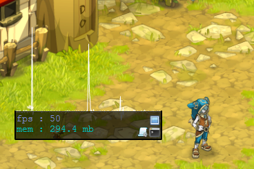
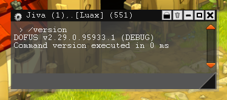
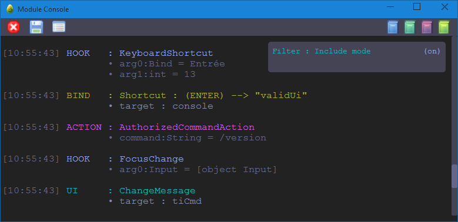
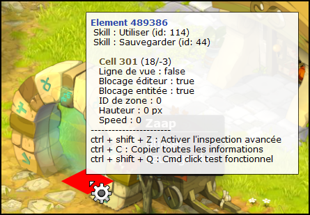
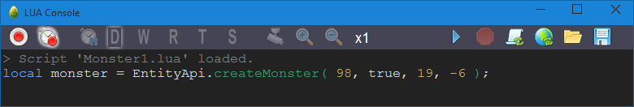
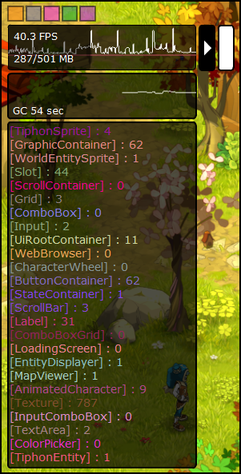

- Une interface de contrôle affichant les FPS et performances du client, ainsi que des raccourcis pour ouvrir les différentes consoles.
- Affichage de la console permettant d'exécuter un certain nombre de commandes telles que le déchargement d'interface ou encore le rechargement d'un module (ouverture via Ctrl + ² par défaut ou /console dans le chat).
- Affichage de la console d'information indiquant quels hooks / actions transitent.

Pour le débloquer il suffit d'ajouter une ligne au fichier de configuration de Dofus **secondaire** (`config-custom.xml`):

```xml
<entry key="dev.mode">true</entry>
<entry key="dev.auto.display.controler">true</entry>
<entry key="dev.auto.display.eventUtil">true</entry>
<entry key="dev.auto.display.luaUtil">true</entry>
<entry key="boo">true</entry>
```

config-custom.xml complet et commenté: [cliquez ici](../resources/dev/config-custom.xml)

## Interface de contrôle



Cette interface affiche plusieurs informations utiles : 
- Les FPS actuels du client Dofus.
- La mémoire consommée par le client.
- La courbe de performance du client (Cette courbe indique le nombre de millisecondes utilisées par chaque frame).

Les trois petites icônes sur la droite permettent d'ouvrir la console, la fenêtre de log ainsi que la fenêtre des scripts lua. 

## Console



La console vous permet de taper divers commandes de debug. Tapez la commande /help pour en avoir la liste (Chaque commande doit être précédée par le caractère `/` autrement la commande sera envoyer au serveur). 

Liste compète des commandes : [cliquez ici](../resources/dev/help.md)

## Fenêtre de log



La fenêtre de log permet d'afficher des informations importantes sur le comportement du client et vous permet aussi d'y afficher vous même certaines informations.

Les boutons du haut de cette fenêtre vous permettant de: 
- Supprimer le contenu de la fenêtre (croix rouge).
- Enregistrer les logs dans un fichier (disquette).
- Ouvrir la fenêtre de filtre (cette fenêtre vous permet de filtrer le contenu des logs).
- Afficher/Masquer certaines informations comme les hooks, les actions, les raccourcis ou encore les évènements d'interface.

Vous pouvez aussi ajouter vos propres logs en utilisant la méthode log() de la classe SystemApi. 

Par défaut, la fenêtre de log affiche 4 types de messages différents : 
- Les hooks
- Les actions
- Les raccourcis
- Les événements d'interface

### Les hooks (HOOK)

Les hooks sont affichés en bleu avec la liste des arguments qu'ils contiennent ainsi que leurs types et leurs valeurs.

```
[13:38:42] HOOK : TextInformation 
                - arg0:String = Le percepteur Johmy Do'Thone attaqué en 9,6 n'a pas survécu ! 
                - arg1:int = 2
```

```
[13:37:00] HOOK : StorageViewContent 
                - arg0:Vector.<Object> = [ItemWrapper#4592],[ItemWrapper#4590],[ItemWrapper#4480] 
                - arg1:int = 11877955
```

### Les actions (ACTION)

Les actions sont affichées en rose avec la liste de leurs propriétés ainsi que de leurs valeurs.  
Par exemple lors de l'envoie d'un message dans le chat :

```
[13:39:59] ACTION : ChatTextOutputAction 
                  - receiverName:String = 
                  - content:String = Bonjour 
                  - objects:Array = null 
                  - channel:uint = 0
```

### Les raccourcis (BIND)

Les raccourcis sont affichés en jaune avec le nom de la touche utilisée ainsi que les noms des interfaces qui ont écouté le raccourci.

```
[16:49:52] BIND : Shortcut : (ESCAPE) --> "closeUi" 
                - target : banner 

[16:49:52] BIND : Shortcut : (ESCAPE) --> "closeUi" 
                - target : chat 

[16:49:52] BIND : Shortcut : (ESCAPE) --> "closeUi" 
                - target : __module_Ankama_GameUiCore
```

```
[16:52:09] BIND : Shortcut : (ENTER) --> "altValid" Alt+ 
                - target : chat
```

### Les événements d'interface (UI)

Les évènements d'interface sont affichés en vert, ils indiquent les manipulations d'interface en cours. Par exemple, ces messages vous indiqueront sur quel composant vous venez de cliquer ou d'effectuer un RollOver.

```
[17:04:44] UI : ItemRollOutMessage 
              - target : gd_spellitemotes 

[17:04:45] UI : SelectItemMessage 
              - target : gd_spellitemotes
```

```
[17:06:00] UI : MouseOverMessage 
              - target : btn_items 

[17:06:00] UI : MouseClickMessage 
              - target : btn_items
```

Pour obtenir plus de détails sur les logs, rendez vous sur la page [Système de log](Systeme-de-log.md).

## Inspecteur d'éléments



L'inspecteur d'éléments permet d'obtenir des informations sur l'élément ou l'entité ciblé comme par exemple un joueur,un PNJ, un montre, un objet interactif (porte, Zaap, poubelle etc...).

Cet utilitaire ce lance via la commande `/uiinspector` depuis la console (même commande pour le désactiver). Il est fort utile pour récupérer les apparence des PNJ ou les interactiveId des objets.

## Scripts lua



La fenêtre permet d'ouvrir et exécuter des scripts lua, une section lui est consacrer, [cliquez ici](Scripts-Lua.md)

## FPS Manager



Le FPS Manager permet d'afficher le nombre d'élément présent à l'instant T sur le client ainsi que des graphique détaillant la consommation mémoire du client.

Cet utilitaire ce lance via la commande `/fpsmanager` depuis la console.
