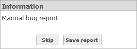
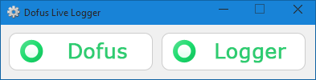

Dofus intègre un système de log performant qui peut être rediriger vers différente sortie tel que la console admin, un rapport HTML, un serveur socket, un fichier log (encoder ou en clair). Le plus intéressant reste le rapport HTML, il fournis en plus des logs une multitudes d'information sur le compte, le personnage, la map etc...

Voici les différents sortie des log et comment y accéder/lire.

## Rapport HTML

Le rapport HTML est le plus simple à obtenir, il suffit juste de créer un fichier (vide) nommer `debug.txt` à la racine du jeu (où ce trouve Dofus.exe).
Après il suffit simplement de presser la touche F11 et de sauvegarde le rapport.



Voir le résultat : [cliquez ici](../resources/log/log-html-report.png)

Liste des informations fournis :

- Logs du client
- Infos du PC
- Infos du compte:
 - Type et version du client
 - Nom de compte
 - Serveur
 - Personnage
 - Map ID
 - Apparence
- Capture d'écran
- Infos de la carte
- Message d'erreurs

## Activation des autres sorties

Pour activer les autres sortie de logs il existe un fichier nommé `log4as.xml` à la racine du jeu qu'il faut modifier. Ce fichier permet de chargé les modules de log souhaité.

Pour chaque type de sorties, la ligne d'activation a placé au milieu de ce code sera indiqué

```xml
<logging>
    <targets>
        <!-- liste des modules ici -->
     </targets>
</logging>
```

### Sorite réseau

**Serveur chacha :smile:**

Cette sortie s'appel le "**serveur chacha**" car au sein d'Ankama, un serveur répondant sous le petit nom de **chacha.ankama.lan** permet de recevoir les logs (le client se connecte dessus avec le port **6666**).
Il existe sûrement un programme qui permet ensuite de récuperer et exploiter ses logs mais il est également possible de recréer ce serveur et d'afficher les logs directement dans la console.

```xml
<target module="com.ankamagames.jerakine.logger.targets.CentralizeTarget">
```

**Serveur local**

Même principe que le serveur distant sauf que cette fois le serveur est en local (connexion sur **localhost:4444**).
La verbosité de cette sortie est plus faible et elle demande à être "nettoyé" des balise qui l'entour.

```xml
<target module="com.ankamagames.jerakine.logger.targets.SOSTarget"/>
```

### Fichier log

Chemin d'accès pour les fichier log (.log et .d2l) : `C:\Users\{user}\AppData\Roaming\Dofus 2\logs`
(Accès rapide : **%AppData%**)

**FileTarget**

Le FileTarget est le fichier log générer en claire.

```xml
<target module="com.ankamagames.jerakine.logger.targets.FileTarget"/>
```

**Fichier .d2l**

Les fichiers log .d2l sont générés automatiquement sur tous les clients, contrairement au FileTarget celui-ci est encoder. Aucun raison de s'attardé sur l'encodage en question, il suffit simplement d'utiliser les sortie spécifié plus haut.

## Live Logger

Live Logger un est programme créer par Luax permettant d'obtenir les logs en direct grâce à la sortie de log vers un serveur local (SOSTarget)

Téléchargez [Dofus Live Logger](https://github.com/LuaxY/Dofus-Live-Logger/releases), remplacez le fichier `log4as.xml` dans votre client et lancez l'exécutable `NetworkInspector.exe`.

Rendez-vous sur la page d'affichage des logs ([cliquez ici](https://yann.voidmx.net/logger.html)) et cliquez sur connexion, puis lancez Dofus.

Si vous avez correctement suivis la procédure, les deux élément sur le logiciel passe au vert



Et vous recevrez en live les logs de Dofus sur la page web, même en cas de crash de celui-ci.

Voir le résultat : [cliquez ici](../resources/log/log-live-web.png)
