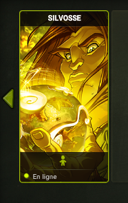
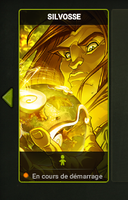
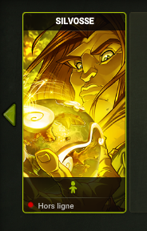

# ServersListMessage
<b>
Id: 30.

Context: Post-authentification.
</b>

Description: Ce message est envoyé au client lorsque la phase d'authentification s'est déroulée avec succès. Il permet d'afficher la liste des serveurs joignables.

## Servers (GameServerInformations Array[])
### GameServerInformations
#### ServerId (Integer)
Description: L'id du serveur.

#### Type (Short)
Description: Le type de serveur.  
* A préciser.

#### State (Short)
Description: L'état actuel du serveur de jeu.
* 0: Statut Inconnu
* 1: Hors ligne
* 2: En cours de démarrage.
* 3: En ligne

#### Completion (Short)
Description: L'état de la population du serveur.

#### isSelectable (Boolean)
Description: Définit si il est possible ou non de sélectionner ce serveur de jeu.

#### charactersCount (Short)
Description: Le nombre de personnage que vous possèdez sur ce serveur.

#### date (Short)
A préciser.

## alreadyConnectedTo (Integer)
Description: Si vous êtes déjà connecter a un serveur, l'id de ce serveur, 0 sinon.

## canCreateNewChar (Boolean)
Description: Définit si vous pouvez créer des personnage sur ce serveur.


## Paquet
```
[NETWORK] : GameServerInformations [{"serverId":"10","type":1,"state":3,"completion":0,"isSelectable":true,"charactersCount":1,"date":1}] alreadyConnectedto: 0 canCreateNewChar: true
[NETWORK] : Sended packet 'ServersListMessage' (id: 30, packetlen: 19, len: 22 -- 2048)
```




